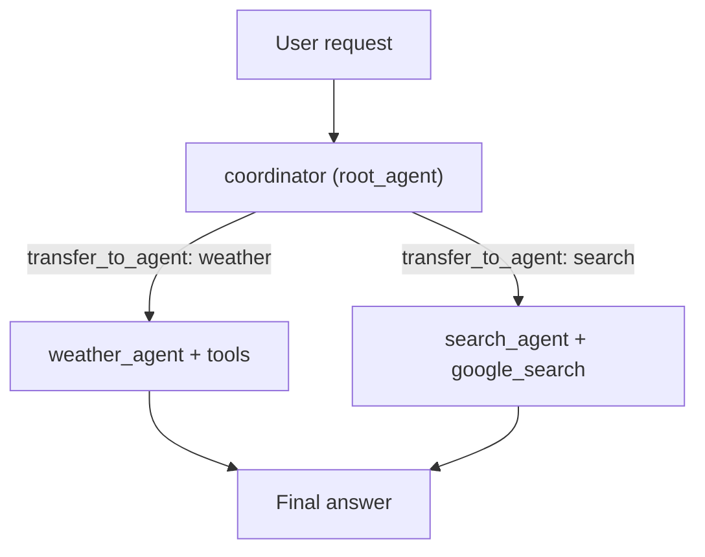

# Challenge Three: Developing Multi-Agent Systems

This notebook builds on Challenge Two by creating a **multi-agent ADK system** with a coordinating root agent and two specialist agents. The full solution lives in [`multi_agent_system.ipynb`](multi_agent_system.ipynb).

## Goal

Demonstrate the ability to program multi-agent systems using Google ADK.

## Requirements Met

- **Three-agent architecture**: Implemented a root coordinator agent, a weather agent, and a search agent.
- **Search agent with ADK built-in tool**: The search agent uses ADK built-in `google_search`.
- **Delegation from root to sub-agents**: The root agent receives user requests and delegates weather queries to `weather_agent` and general/current-events queries to `search_agent`.
- **Event output proof of delegation**: Test code prints streamed ADK events (including transfer and tool-call activity) to demonstrate sub-agent usage.

## How to run

1. Open [`multi_agent_system.ipynb`](multi_agent_system.ipynb) in **Agent Platform Colab Enterprise** (or a Vertex AI-authenticated Jupyter environment).
2. Run the cells top to bottom.
3. Review the event output in the test cell to confirm root-agent delegation and specialist tool calls.

## Delegation flow

## Compatibility note

The notebook's primary implementation follows the challenge requirement and uses `sub_agents=[weather_agent, search_agent]`.  
Some ADK versions document limitations for built-in tools in sub-agents, so the notebook also includes an optional fallback builder that wraps the search agent using `AgentTool` if needed.
