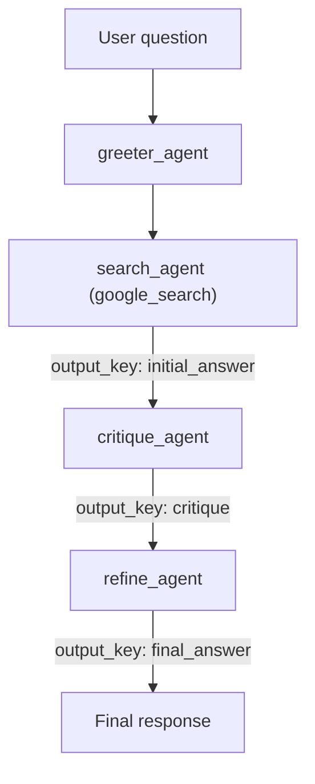

# Challenge Four: Programming an Agent Workflow

This notebook builds **Cloud Security Advisor**, an ADK `SequentialAgent` workflow that answers a question, then verifies and refines the answer before returning it. The full solution lives in [`agent_workflow.ipynb`](agent_workflow.ipynb).

## Goal

Demonstrate the ability to program a complex process using ADK workflow agents.

## Requirements Met

- **Four sub-agents**: Implemented `greeter_agent`, `search_agent`, `critique_agent`, and `refine_agent`.
- **Workflow that answers, verifies, and refines**: A `SequentialAgent` runs the stages in strict order so the initial answer is critiqued and rewritten before it is returned.
- **Search finds the data**: `search_agent` uses the ADK built-in `google_search` tool to research the question.
- **Critique suggests improvements**: `critique_agent` reviews the initial answer for accuracy, completeness, clarity, and missing security considerations.
- **Refine rewrites the response**: `refine_agent` produces the final answer based on the critique.
- **Event output proof**: The test cell prints streamed events labeled by sub-agent author, so it is clear when each agent runs and how the response evolves.

## Workflow flow

Data flows between stages through shared session state: each agent writes its result with `output_key`, and downstream agents read it via `{state_key}` instruction templating.

## How to run

1. Open [`agent_workflow.ipynb`](agent_workflow.ipynb) in **Agent Platform Colab Enterprise** (or a Vertex AI-authenticated Jupyter environment).
2. Run the cells top to bottom.
3. Review the event output in Step 6. The demonstration question is:
   *"What are the best practices for securing a private GKE cluster handling sensitive data?"*

## Compatibility note

`SequentialAgent` orchestration is deterministic (it does not use LLM-driven transfer). The only built-in-tool gotcha is the search stage: Gemini rejects mixing the built-in `google_search` tool with any other tool, so `disallow_transfer_to_parent=True` and `disallow_transfer_to_peers=True` are set on `search_agent` to keep `google_search` as its only tool.
