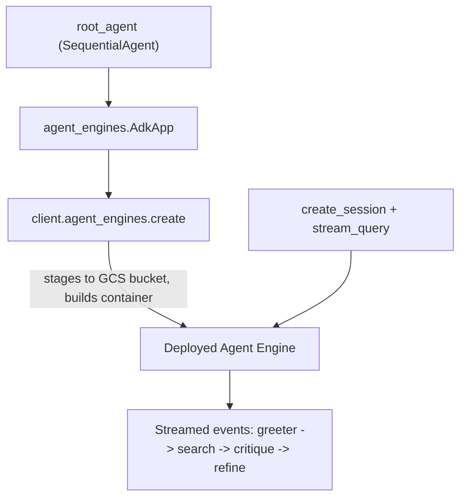

# Challenge Five: Deploying an Agent to Agent Platform

This notebook reuses the **Cloud Security Advisor** `SequentialAgent` from Challenge Four and deploys it to **Vertex AI Agent Engine** (Agent Platform), then tests the deployed agent. The full solution lives in [`deploy_agent.ipynb`](deploy_agent.ipynb).

## Goal

Demonstrate the ability to deploy and use an agent with Google Agent Platform.

## Requirements Met

- **Create an agent using the ADK**: Rebuilds the Challenge Four `SequentialAgent` (Greeter -> Search -> Critique -> Refine) as `root_agent`.
- **Deploy the agent to Agent Platform**: Wraps it in `agent_engines.AdkApp` and deploys with `client.agent_engines.create`, staging artifacts to a Cloud Storage bucket.
- **Test the agent**: Creates a session on the deployed (remote) agent and streams a query, printing per-sub-agent events to prove it runs on Agent Platform.

## Deployment flow

## How to run

1. Open [`deploy_agent.ipynb`](deploy_agent.ipynb) in **Agent Platform Colab Enterprise** (or a Vertex AI-authenticated Jupyter environment).
2. Run the cells top to bottom.
3. Step 6 (deployment) is asynchronous and can take several minutes.
4. Step 7 runs the test query against the deployed agent:
   *"What are the best practices for securing a private GKE cluster handling sensitive data?"*
5. Step 8 (optional) deletes the deployment to clean up resources.

## Notes

- Requires the Vertex AI / Agent Engine and Cloud Storage APIs enabled on the project; the runtime service account needs Storage and Vertex AI permissions (default in Qwiklabs labs).
- A staging bucket (`<project-id>-agent-engine-staging`) is created automatically if it does not already exist.
- The `search_agent` keeps `disallow_transfer_to_parent/peers=True` so the built-in `google_search` tool is not combined with an auto-added transfer tool (Gemini 400 error).
