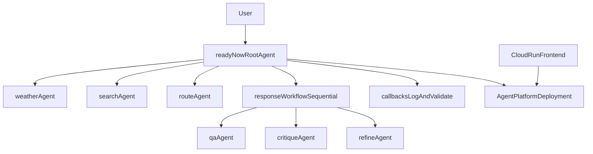

# Challenge Six: Federal Emergency Machine Assistant (ReadyNow)

This challenge delivers a complete ADK-based emergency preparedness assistant for FEMA's ReadyNow case study. It combines specialist sub-agents, callback-based logging, Model Armor-backed prompt validation, a sequential answer-refinement workflow, Agent Platform deployment code, and in-notebook integration tests, plus a lightweight FastAPI frontend.

The entire agent solution is **self-contained inside [`emergency_preparedness.ipynb`](emergency_preparedness.ipynb)** - dependencies, configuration, tools, callbacks, agents, deployment helpers, and tests all live in notebook cells. The only separate component is the optional FastAPI `frontend/`.

## Goal

Demonstrate the ability to build and validate a complex multi-agent system using the Google Agent Development Kit (ADK), then deploy and test it on Agent Platform.

## Requirements met

- Root coordinator agent that describes capabilities and delegates to specialists.
- Specialist agents for weather forecasting, internet search, evacuation routes, and question answering.
- Sequential workflow (`qa_agent` -> `critique_agent` -> `refine_agent`) to validate and improve responses.
- Callback functions for user/model logging and Model Armor-backed user input validation.
- Local notebook tests and deployed-agent tests.
- Agent Platform deployment flow.
- In-notebook integration checks for the deployed runtime.
- FastAPI frontend runnable locally and deployable to Cloud Run.

## Architecture



The notebook also reserves an architecture-diagram image placeholder at the top of the first cell; replace `architecture.png` there with the provided diagram.

## Project layout

```text
challenge-6/
|- emergency_preparedness.ipynb   # Self-contained agent solution (code + tests + markdown)
|- README.md
|- frontend/                      # Separate FastAPI service (local / Cloud Run)
   |- main.py
   |- requirements.txt
   |- Dockerfile
   |- static/
      |- index.html
      |- app.js
      |- styles.css
```

## Notebook flow

Open [`emergency_preparedness.ipynb`](emergency_preparedness.ipynb) in Colab Enterprise and run cells in order:

1. Install dependencies (inline; no external requirements file).
2. Configure environment and initialize Vertex AI.
3. Model Armor preflight check.
4. Define tool functions.
5. Define callbacks (logging + Model Armor validation).
6. Build the ReadyNow root agent.
7. Local execution helpers and local test prompts.
8. Deploy to Agent Platform.
9. Test the deployed runtime and run in-notebook integration checks.

## Model Armor setup

Set these before running the notebook configuration cell (Step 2):

```bash
export GOOGLE_CLOUD_PROJECT="your-project-id"
export GOOGLE_CLOUD_LOCATION="us-central1"
export GOOGLE_MAPS_API_KEY="your-maps-key"
export MODEL_ARMOR_TEMPLATE_ID="projects/your-project-id/locations/us-central1/templates/your-template-id"
```

You can also provide only the template ID and let the callback build the full resource name:

```bash
export MODEL_ARMOR_TEMPLATE_ID="your-template-id"
export MODEL_ARMOR_PROJECT_ID="your-project-id"
export MODEL_ARMOR_LOCATION="us-central1"
```

Required permission for the runtime identity:
- `modelarmor.templates.useToSanitizeUserPrompt` on the Model Armor template (for example via `roles/modelarmor.user`).

Important:
- Keep `MODEL_ARMOR_LOCATION` aligned with the template location.
- Validation is configured **fail-closed**: if Model Armor is unavailable, requests are blocked.

## In-notebook integration checks

The former standalone pytest suite is now an in-notebook cell (Step 13). It validates both successful refined-response generation and malicious-input blocking against the deployed agent. Set these before running it:

```bash
export GOOGLE_CLOUD_PROJECT="your-project-id"
export GOOGLE_CLOUD_LOCATION="us-central1"
export AGENT_ENGINE_RESOURCE_NAME="projects/.../locations/.../reasoningEngines/..."
```

The checks skip automatically when `AGENT_ENGINE_RESOURCE_NAME` is not set.

## Run the frontend locally

From `challenge-6/frontend/`:

```bash
python -m pip install -r requirements.txt
export GOOGLE_CLOUD_PROJECT="your-project-id"
export GOOGLE_CLOUD_LOCATION="us-central1"
export AGENT_ENGINE_RESOURCE_NAME="projects/.../locations/.../reasoningEngines/..."
uvicorn main:app --reload --port 8080
```

Open [http://localhost:8080](http://localhost:8080).

## Deploy frontend to Cloud Run

From repository root:

```bash
gcloud builds submit challenge-6 \
  --tag gcr.io/your-project-id/readynow-frontend:latest \
  --file challenge-6/frontend/Dockerfile

gcloud run deploy readynow-frontend \
  --image gcr.io/your-project-id/readynow-frontend:latest \
  --region us-central1 \
  --allow-unauthenticated \
  --set-env-vars GOOGLE_CLOUD_PROJECT=your-project-id,GOOGLE_CLOUD_LOCATION=us-central1,AGENT_ENGINE_RESOURCE_NAME=projects/.../locations/.../reasoningEngines/...
```

Use `frontend/Dockerfile` for container builds:

```bash
docker build -f frontend/Dockerfile -t readynow-frontend:local .
docker run --rm -p 8080:8080 \
  -e GOOGLE_CLOUD_PROJECT=your-project-id \
  -e GOOGLE_CLOUD_LOCATION=us-central1 \
  -e AGENT_ENGINE_RESOURCE_NAME=projects/.../locations/.../reasoningEngines/... \
  readynow-frontend:local
```

## Notes

- `search_agent` sets `disallow_transfer_to_parent` and `disallow_transfer_to_peers` to avoid the Gemini built-in tool mixing constraint for `google_search`.
- Prompt safety checks use Model Armor (`sanitizeUserPrompt`) before custom US-location and mission-scope checks.
- This workshop code targets ephemeral lab projects; avoid hard-coded keys in long-lived environments.
