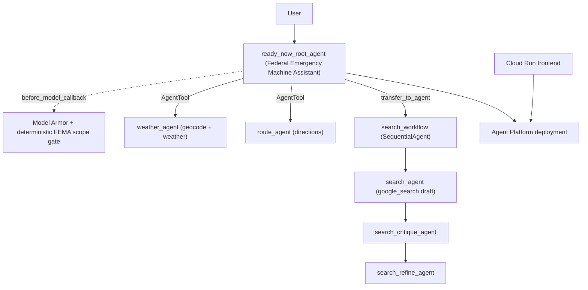

# Challenge Six: Federal Emergency Machine Assistant (ReadyNow)

ReadyNow - the **Federal Emergency Machine Assistant** - is a US emergency-preparedness assistant built with the Google ADK. A root LLM orchestrator calls specialist tools, enforces a FEMA-only scope, validates input with Model Armor, and validates its web-sourced answers through a critique/refine workflow. It also includes Agent Platform deployment code, in-notebook integration checks, and a lightweight FastAPI frontend.

The entire agent solution is **self-contained inside [`emergency_preparedness.ipynb`](emergency_preparedness.ipynb)** - dependencies, configuration, tools, callbacks, agents, deployment helpers, and tests all live in notebook cells. The only separate component is the optional FastAPI `frontend/`.

## Core services

1. **Weather + emergency planning** - current US weather conditions and risk; when weather is dangerous, ReadyNow proactively follows up with preparedness guidance and offers an evacuation route.
2. **Evacuation routes** - driving/route guidance between US locations, composable with the weather flow (e.g., leave town ahead of a hurricane or wildfire).
3. **FEMA / natural-disaster guidance** - validated, web-sourced answers for disasters (weather, earthquakes, etc.), official FEMA guidance, nearby shelters, active alerts/declarations, and emergency supply-kit / family-plan help.

## Goal

Demonstrate the ability to build and validate a complex agent system using the Google Agent Development Kit (ADK), then deploy and test it on Agent Platform.

## Requirements met

- Root LLM orchestrator that describes its own capabilities and calls specialists as tools (so multi-part prompts are handled in one turn).
- Specialist tools for weather forecasting, evacuation routes, and a validated internet-search workflow.
- Validated search path: `search_agent` (draft) -> `search_critique_agent` -> `search_refine_agent`.
- Deterministic FEMA-only scope gate plus Model Armor input validation, with logging callbacks.
- Local notebook tests and deployed-agent tests.
- Agent Platform deployment flow.
- In-notebook integration checks for the deployed runtime.
- FastAPI frontend runnable locally and deployable to Cloud Run.

## Architecture



The notebook also reserves an architecture-diagram image placeholder at the top of the first cell; replace `architecture.png` there with the provided diagram.

## Project layout

```text
challenge-6/
|- emergency_preparedness.ipynb   # Self-contained agent solution (code + tests + markdown)
|- README.md
|- frontend/                      # Separate FastAPI service (local / Cloud Run)
   |- main.py
   |- requirements.txt
   |- Dockerfile
   |- static/
      |- index.html
      |- app.js
      |- styles.css
```

## Notebook flow

Open [`emergency_preparedness.ipynb`](emergency_preparedness.ipynb) in Colab Enterprise and run cells in order:

1. Install dependencies (inline; no external requirements file).
2. Configure environment and initialize Vertex AI.
3. Model Armor preflight check.
4. Define tool functions.
5. Define callbacks (logging + Model Armor validation).
6. Build the ReadyNow root agent.
7. Local execution helpers and local test prompts.
8. Deploy to Agent Platform.
9. Test the deployed runtime and run in-notebook integration checks.

## Model Armor setup

### Enable the API first (instructor / one-time per project)

Model Armor has **no default template**, and the API is not enabled by default. Before running the notebook, enable the API once for the lab project:

```bash
gcloud services enable modelarmor.googleapis.com --project=your-project-id
```

The runtime identity needs `roles/modelarmor.admin` to create a template (notebook Step 2c creates `ma-template` automatically if it is missing), or at least `roles/modelarmor.user` if the template already exists. If the API is not enabled or permissions are missing, Step 2c raises a clear error explaining what to fix.

### Environment variables

Set these before running the notebook configuration cell (Step 2):

```bash
export GOOGLE_CLOUD_PROJECT="your-project-id"
export GOOGLE_CLOUD_LOCATION="us-central1"
export GOOGLE_MAPS_API_KEY="your-maps-key"
export MODEL_ARMOR_TEMPLATE_ID="projects/your-project-id/locations/us-central1/templates/your-template-id"
```

You can also provide only the template ID and let the callback build the full resource name:

```bash
export MODEL_ARMOR_TEMPLATE_ID="your-template-id"
export MODEL_ARMOR_PROJECT_ID="your-project-id"
export MODEL_ARMOR_LOCATION="us-central1"
```

Required permission for the runtime identity:
- `modelarmor.templates.useToSanitizeUserPrompt` on the Model Armor template (for example via `roles/modelarmor.user`).

Important:
- Keep `MODEL_ARMOR_LOCATION` aligned with the template location.
- Validation is configured **fail-closed**: if Model Armor is unavailable, requests are blocked.

## In-notebook integration checks

The former standalone pytest suite is now an in-notebook cell (Step 13). It validates both successful refined-response generation and malicious-input blocking against the deployed agent. Set these before running it:

```bash
export GOOGLE_CLOUD_PROJECT="your-project-id"
export GOOGLE_CLOUD_LOCATION="us-central1"
export AGENT_ENGINE_RESOURCE_NAME="projects/.../locations/.../reasoningEngines/..."
```

The checks skip automatically when `AGENT_ENGINE_RESOURCE_NAME` is not set.

## Run the frontend locally

From `challenge-6/frontend/`:

```bash
python -m pip install -r requirements.txt
export GOOGLE_CLOUD_PROJECT="your-project-id"
export GOOGLE_CLOUD_LOCATION="us-central1"
export AGENT_ENGINE_RESOURCE_NAME="projects/.../locations/.../reasoningEngines/..."
uvicorn main:app --reload --port 8080
```

Open [http://localhost:8080](http://localhost:8080).

## Deploy frontend to Cloud Run

From repository root:

```bash
gcloud builds submit challenge-6 \
  --tag gcr.io/your-project-id/readynow-frontend:latest \
  --file challenge-6/frontend/Dockerfile

gcloud run deploy readynow-frontend \
  --image gcr.io/your-project-id/readynow-frontend:latest \
  --region us-central1 \
  --allow-unauthenticated \
  --set-env-vars GOOGLE_CLOUD_PROJECT=your-project-id,GOOGLE_CLOUD_LOCATION=us-central1,AGENT_ENGINE_RESOURCE_NAME=projects/.../locations/.../reasoningEngines/...
```

Use `frontend/Dockerfile` for container builds:

```bash
docker build -f frontend/Dockerfile -t readynow-frontend:local .
docker run --rm -p 8080:8080 \
  -e GOOGLE_CLOUD_PROJECT=your-project-id \
  -e GOOGLE_CLOUD_LOCATION=us-central1 \
  -e AGENT_ENGINE_RESOURCE_NAME=projects/.../locations/.../reasoningEngines/... \
  readynow-frontend:local
```

## Notes

- `weather_agent` and `route_agent` are exposed as `AgentTool`s, so a multi-part prompt (e.g., weather risk plus an evacuation route) triggers multiple tool calls combined into one answer.
- `search_workflow` is reached by **delegation** (`sub_agents` + `transfer_to_agent`), not as a tool, so its `search_agent` -> `search_critique_agent` -> `search_refine_agent` stages stream as top-level events (full visibility, like challenge-4). Trade-off: because it is a handoff, a search question is not combined in the same turn with weather/route.
- Only the search path is wrapped in critique -> refine, because that is where the answer is synthesized; `weather_agent` and `route_agent` return deterministic tool data and are left plain.
- `google_search` stays isolated inside `search_agent` (its own workflow stage), so there is no built-in-tool mixing at the root.
- Scope is enforced two ways: a deterministic FEMA keyword/capability gate in `before_model_callback` (after Model Armor `sanitizeUserPrompt`), plus the root instruction that refuses off-topic requests.
- This workshop code targets ephemeral lab projects; avoid hard-coded keys in long-lived environments.
