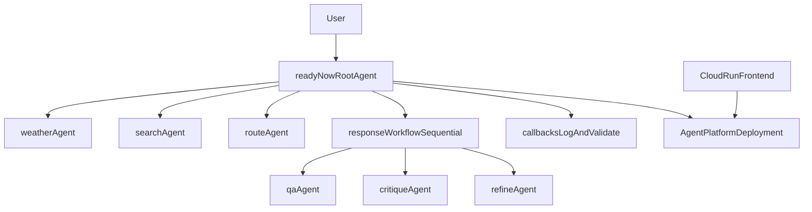

# Challenge Six: Federal Emergency Machine Assistant (ReadyNow)

This challenge delivers a complete ADK-based emergency preparedness assistant for FEMA's ReadyNow case study. It combines specialist sub-agents, callback-based logging and validation, a sequential answer-refinement workflow, Agent Platform deployment code, deployed-agent pytest integration tests, and a lightweight FastAPI frontend.

## Goal

Demonstrate the ability to build and validate a complex multi-agent system using the Google Agent Development Kit (ADK), then deploy and test it on Agent Platform.

## Requirements met

- Root coordinator agent that describes capabilities and delegates to specialists.
- Specialist agents for weather forecasting, internet search, evacuation routes, and question answering.
- Sequential workflow (`qa_agent` -> `critique_agent` -> `refine_agent`) to validate and improve responses.
- Callback functions for user/model logging and user input validation.
- Local notebook tests and deployed-agent tests.
- Agent Platform deployment flow.
- Pytest integration tests for deployed runtime.
- FastAPI frontend runnable locally and deployable to Cloud Run.

## Architecture



## Image-model prompt for architecture diagram

Use this prompt with your preferred image model:

> Create a clean technical architecture diagram titled "FEMA ReadyNow Emergency Preparedness Multi-Agent System". Show: (1) User chat interface, (2) Root coordinator agent, (3) Weather Forecast Agent calling Google Weather API and Geocoding, (4) Internet Search Agent calling Google Search, (5) Route Agent calling Google Maps Routes API, (6) Q&A Agent for safety responses, (7) Sequential validation pipeline with Answer -> Critique -> Refine stages, (8) Callback layer for prompt/response logging and user-input validation, (9) Agent Platform deployment boundary on Google Cloud, (10) Frontend service on Cloud Run invoking deployed Agent Engine. Include directional arrows for data flow, grouped boxes for Local Testing vs Deployed Runtime, and labels for session state and event streaming. Style: modern, minimal, high contrast, white background, blue/gray palette, legible text, presentation-ready.

## Project layout

```text
challenge-6/
|- emergency_preparedness.ipynb
|- README.md
|- requirements.txt
|- requirements-dev.txt
|- pytest.ini
|- agent/
|  |- __init__.py
|  |- config.py
|  |- callbacks.py
|  |- tools.py
|  |- root_agent.py
|- lib/
|  |- __init__.py
|  |- local_runner.py
|  |- remote_client.py
|- tests/
|  |- conftest.py
|  |- test_deployed_integration.py
|- frontend/
   |- main.py
   |- requirements.txt
   |- Dockerfile
   |- static/
      |- index.html
      |- app.js
      |- styles.css
```

## Notebook flow

Open [`emergency_preparedness.ipynb`](emergency_preparedness.ipynb) in Colab Enterprise and run cells in order:

1. Install dependencies.
2. Configure environment and initialize Vertex AI.
3. Build the ReadyNow root agent.
4. Test locally via `AdkApp` event stream.
5. Deploy to Agent Platform.
6. Test remote query against deployed runtime.

## Pytest integration tests (deployed agent)

From `challenge-6/`:

```bash
python -m pip install -r requirements-dev.txt
export GOOGLE_CLOUD_PROJECT="your-project-id"
export GOOGLE_CLOUD_LOCATION="us-central1"
export AGENT_ENGINE_RESOURCE_NAME="projects/.../locations/.../reasoningEngines/..."
pytest -m integration -q
```

The tests skip automatically if required environment variables are missing.

## Run the frontend locally

From `challenge-6/frontend/`:

```bash
python -m pip install -r requirements.txt
export GOOGLE_CLOUD_PROJECT="your-project-id"
export GOOGLE_CLOUD_LOCATION="us-central1"
export AGENT_ENGINE_RESOURCE_NAME="projects/.../locations/.../reasoningEngines/..."
uvicorn main:app --reload --port 8080
```

Open [http://localhost:8080](http://localhost:8080).

## Deploy frontend to Cloud Run

From repository root:

```bash
gcloud builds submit challenge-6 \
  --tag gcr.io/your-project-id/readynow-frontend:latest \
  --file challenge-6/frontend/Dockerfile

gcloud run deploy readynow-frontend \
  --image gcr.io/your-project-id/readynow-frontend:latest \
  --region us-central1 \
  --allow-unauthenticated \
  --set-env-vars GOOGLE_CLOUD_PROJECT=your-project-id,GOOGLE_CLOUD_LOCATION=us-central1,AGENT_ENGINE_RESOURCE_NAME=projects/.../locations/.../reasoningEngines/...
```

Use `frontend/Dockerfile` for container builds:

```bash
docker build -f frontend/Dockerfile -t readynow-frontend:local .
docker run --rm -p 8080:8080 \
  -e GOOGLE_CLOUD_PROJECT=your-project-id \
  -e GOOGLE_CLOUD_LOCATION=us-central1 \
  -e AGENT_ENGINE_RESOURCE_NAME=projects/.../locations/.../reasoningEngines/... \
  readynow-frontend:local
```

## Notes

- `search_agent` sets `disallow_transfer_to_parent` and `disallow_transfer_to_peers` to avoid the Gemini built-in tool mixing constraint for `google_search`.
- This workshop code targets ephemeral lab projects; avoid hard-coded keys in long-lived environments.
